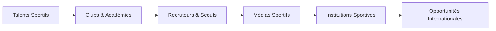

# MSN Talents XI - Guide de Réalisation Xcode (iOS / SwiftUI)

Ce document rassemble l'intégralité du **contexte projet**, des **spécifications techniques pour Xcode**, de l'**architecture des données et écrans**, et de la **feuille de route des fonctionnalités restantes** pour concevoir l'application iOS native.

---

## 📖 Sommaire
1. [Contexte et Vision de la Plateforme](#1-contexte-et-vision-de-la-plateforme)
2. [Architecture Technique & Stack iOS](#2-architecture-technique--stack-ios)
3. [Modèles de Données Swift (Codable)](#3-modèles-de-données-swift-codable)
4. [Contrats d'API REST (Backend Node.js / Express)](#4-contrats-dapi-rest-backend-nodejs--express)
5. [Design System & Charte Graphique (Inspiration Apple & Vert-Bleu)](#5-design-system--charte-graphique-inspiration-apple--vert-bleu)
6. [Spécifications Détaillées des 5 Écrans Clés](#6-spécifications-détaillées-des-5-écrans-clés)
7. [Feuille de Route : Ce qu'il reste à réaliser sur iOS](#7-feuille-de-route--ce-quil-reste-à-réaliser-sur-ios)

---

## 1. Contexte et Vision de la Plateforme

### 1.1 La Vitrine Numérique des Talents Sportifs Sénégalais
**MSN Talents XI** est une infrastructure numérique dédiée à la **détection, la valorisation et la visibilité des talents sportifs sénégalais**, avec un lancement initial centré sur le **football**.

L’objectif est de créer un espace numérique où les jeunes footballeurs (locaux, émergents ou confirmés) peuvent présenter leur profil sportif, mettre en avant leurs performances vidéo (dribles, vitesse, gestes décisifs) et construire leur visibilité auprès des clubs, académies et recruteurs au Sénégal comme à l’international.

### 1.2 Le Constat
- Le Sénégal possède un vivier exceptionnel de talents sportifs.
- Cependant, les performances, vidéos et parcours sont dispersés et peu accessibles pour les recruteurs.
- Beaucoup de jeunes joueurs sont peu familiarisés avec les interfaces complexes ou ont des difficultés de lecture : l'interface doit donc être **extrêmement visuelle, directe et intuitive** (icônes parlantes, boutons tactiles, zéro surcharge textuelle).

### 1.3 Écosystème Cible


### 1.4 Évolution Multi-Sports Prévue
Après la phase 1 (Football), la plateforme s'ouvrira aux autres disciplines sénégalaises majeures :
- 🏀 Basketball
- 🏃 Athlétisme
- 🤼 Lutte sénégalaise
- 🤾 Handball
- 🏐 Volleyball
- 🏊 Natation, Taekwondo, Karaté, Tennis, Cyclisme...

> **Slogan :** *Identifier. Valoriser. Connecter.*

---

## 2. Architecture Technique & Stack iOS

- **Environnement** : Xcode 15+ / 16+, iOS 17+.
- **Framework UI** : **SwiftUI** (déclaratif, animations fluides, composants natifs).
- **Architecture recommandée** : **MVVM** (Model - View - ViewModel) avec `Observation` (`@Observable`).
- **Réseau** : `URLSession` avec `async/await`.
- **Lecture Vidéo** : `AVKit` (`VideoPlayer` et `AVPlayer`).
- **Gestion des Photos/Vidéos** : `PhotosUI` (`PhotosPicker`).
- **Stockage Sécurisé** : `Keychain` pour le JWT, `UserDefaults` pour les préférences simples.
- **Backend cible** : Node.js / Express sur le port `4000` (`http://localhost:4000/api`).

---

## 3. Modèles de Données Swift (Codable)

```swift
import Foundation

// Rôles utilisateurs
enum UserRole: String, Codable {
    case joueur = "JOUEUR"
    case recruteur = "RECRUTEUR"
    case admin = "ADMIN"
}

// Postes sportifs avec icônes visuelles
enum PlayerPosition: String, Codable, CaseIterable {
    case attaquant = "ATTAQUANT"
    case milieu = "MILIEU"
    case defenseur = "DEFENSEUR"
    case gardien = "GARDIEN"
    
    var title: String {
        switch self {
        case .attaquant: return "Attaquant"
        case .milieu: return "Milieu"
        case .defenseur: return "Défenseur"
        case .gardien: return "Gardien"
        }
    }
    
    var icon: String {
        switch self {
        case .attaquant: return "🎯"
        case .milieu: return "⚡"
        case .defenseur: return "🛡️"
        case .gardien: return "🧤"
        }
    }
    
    var subtitle: String {
        switch self {
        case .attaquant: return "Ailier / Buteur"
        case .milieu: return "Meneur / Relayeur"
        case .defenseur: return "Central / Latéral"
        case .gardien: return "Dans les buts"
        }
    }
}

// Pied fort
enum StrongFoot: String, Codable, CaseIterable {
    case droitier = "DROITIER"
    case gaucher = "GAUCHER"
    case ambidextre = "AMBIDEXTRE"
    
    var label: String {
        switch self {
        case .droitier: return "🦶 Droitier"
        case .gaucher: return "🦶 Gaucher"
        case .ambidextre: return "👟 2 Pieds"
        }
    }
}

// Modèle de Joueur complet
struct Player: Identifiable, Codable {
    let id: Int
    let firstName: String
    let lastName: String
    let city: String
    let position: PlayerPosition
    let phone: String?
    let birthDate: String?
    let strongFoot: StrongFoot?
    let height: Int?
    let weight: Int?
    let currentClub: String?
    let bio: String?
    let palmares: String?
    let photoUrl: String?
    let videoUrl: String?
    
    var fullName: String {
        "\(firstName) \(lastName)"
    }
    
    // Résolution d'URL complète pour les médias
    func resolvedPhotoURL(baseURL: String = "http://localhost:4000") -> URL? {
        guard let photoUrl else { return nil }
        if photoUrl.hasPrefix("http") { return URL(string: photoUrl) }
        return URL(string: "\(baseURL)\(photoUrl)")
    }
    
    func resolvedVideoURL(baseURL: String = "http://localhost:4000") -> URL? {
        guard let videoUrl else { return nil }
        if videoUrl.hasPrefix("http") { return URL(string: videoUrl) }
        return URL(string: "\(baseURL)\(videoUrl)")
    }
}

// Réponses d'API
struct PlayersResponse: Codable {
    let players: [Player]
    let fromCache: Bool?
}

struct PlayerDetailResponse: Codable {
    let player: Player
}

struct AuthResponse: Codable {
    let token: String
    let user: UserSummary
}

struct UserSummary: Codable {
    let id: Int
    let email: String
    let role: UserRole
}
```

---

## 4. Contrats d'API REST (Backend Node.js / Express)

L'API est exposée sur `http://localhost:4000/api` :

| Méthode | Route | Description | Format d'envoi | Format de réponse |
| :--- | :--- | :--- | :--- | :--- |
| `POST` | `/auth/register` | Création d'un compte joueur ou recruteur | `application/json` (`email`, `password`, `role`) | `{ token, user }` |
| `POST` | `/auth/login` | Connexion utilisateur | `application/json` (`email`, `password`) | `{ token, user }` |
| `GET` | `/auth/me` | Profil connecté | Header `Authorization: Bearer <JWT>` | `{ user: { id, email, profile } }` |
| `GET` | `/players` | Annuaire complet avec filtres | Query : `?position=ATTAQUANT&city=Dakar&search=Sadio` | `{ players: [Player], fromCache: true/false }` |
| `GET` | `/players/featured` | Joueurs vedettes pour l'accueil | Sans paramètre | `{ players: [Player] }` |
| `GET` | `/players/:id` | Détail complet d'un joueur | Route param `:id` | `{ player: Player }` |
| `POST` | `/players/my-profile` | Créer ou éditer sa vitrine | `multipart/form-data` | `{ message, profile }` |

### Champs du formulaire `multipart/form-data` (`/players/my-profile`) :
- `firstName` *(String, requis)*
- `lastName` *(String, requis)*
- `city` *(String, requis)*
- `position` *(String, requis : ATTAQUANT, MILIEU, DEFENSEUR, GARDIEN)*
- `phone` *(String, facultatif)*
- `birthDate` *(String YYYY-MM-DD, facultatif)*
- `strongFoot` *(String, facultatif)*
- `height` *(String/Int, facultatif)*
- `weight` *(String/Int, facultatif)*
- `currentClub` *(String, facultatif)*
- `bio` *(String, facultatif)*
- `palmares` *(String, facultatif)*
- `videoUrlLink` *(String URL externe, facultatif)*
- `photo` *(Fichier image binaire, facultatif)*
- `video` *(Fichier vidéo binaire MP4/MOV, facultatif)*

---

## 5. Design System & Charte Graphique (Inspiration Apple & Vert-Bleu)

L'application respecte les **Apple Human Interface Guidelines (HIG)** avec un choix de teintes **Vert-Bleu / Teal Océan** apaisant pour la rétine et offrant un contraste certifié WCAG AAA :

### Palette de Couleurs
```swift
import SwiftUI

extension Color {
    // Vert-Bleu / Teal profond (Action principale, WCAG AAA sur blanc)
    static let msnTeal = Color(red: 15/255, green: 118/255, blue: 110/255)       // #0F766E
    static let msnTealDark = Color(red: 17/255, green: 94/255, blue: 89/255)     // #115E59
    static let msnMintSoft = Color(red: 240/255, green: 253/255, blue: 250/255)  // #F0FDFA
    
    // Nuit Pétrole (Arrière-plan sombre apaisant, remplace le noir pur)
    static let msnDarkPetrol = Color(red: 4/255, green: 25/255, blue: 32/255)    // #041920
    static let msnHeroMidnight = Color(red: 4/255, green: 29/255, blue: 36/255)  // #041D24
    
    // Accents vifs
    static let msnCyan = Color(red: 45/255, green: 212/255, blue: 191/255)       // #2DD4BF
    static let msnOceanBlue = Color(red: 2/255, green: 132/255, blue: 199/255)   // #0284C7
    static let msnSlateBg = Color(red: 248/255, green: 250/255, blue: 252/255)   // #F8FAFC
}
```

### Formes & Rayons de Courbure (Apple Squircles & Pills)
- **Boutons & Badges** : `.clipShape(Capsule())` ou `border-radius: 980px`.
- **Cartes Joueurs & Médias** : `RoundedRectangle(cornerRadius: 24, style: .continuous)`.
- **Champs de saisie & sélecteurs** : `RoundedRectangle(cornerRadius: 14, style: .continuous)`.
- **Navbar Frosted Glass** : `NavigationStack` ou barre personnalisée avec effet `.ultraThinMaterial` / `blur`.

---

## 6. Spécifications Détaillées des 5 Écrans Clés

### Écran 1 : Accueil (`HomeView`)
1. **Hero Section Nocturne (`#041D24`)** :
   - Badge pill translucide en haut : `⚽ MSN TALENTS XI • SÉNÉGAL`.
   - Titre percutant avec mot scintillant dégradé Cyan / Vert-Bleu.
   - **Lecteur Vidéo Dribles en vedette (`AVPlayer`)** en boucle silencieuse dans un cadre squircle 24pt avec bordure cyan et ombre douce.
   - Sélecteur horizontal de 3 clips de dribles : boutons capsules pour basculer instantanément de vidéo.
   - Deux boutons CTA principaux :
     - Bouton capsule Vert-Bleu `🔥 Découvrir les Talents`.
     - Bouton capsule contour blanc `+ Rejoindre la vitrine`.
   - 3 stats rapides : `100% Football Sénégal`, `HD Vidéos`, `Direct Clubs & Recruteurs`.
2. **Section Talents à la Une** :
   - Grille verticale ou carrousel horizontal des profils récents avec photos, badges de postes et indication vidéo.

### Écran 2 : Annuaire des Talents (`PlayersListView`)
1. **Barre de Recherche Capsule** : filtre instantané par nom, prénom ou club.
2. **Filtre horizontal de Villes (Chips scrollables)** :
   - Boutons capsules : `Toutes`, `Dakar`, `Thiès`, `Ziguinchor`, `Saint-Louis`, `Mbour`, `Kaolack`...
3. **Filtre par Poste** :
   - 4 capsules : `🎯 Attaquants`, `⚡ Milieux`, `🛡️ Défenseurs`, `🧤 Gardiens`.
4. **Indicateur Cache Redis** :
   - Badge discret `⚡ Cache Redis Actif` quand `fromCache == true`.
5. **Cartes de Joueurs (`PlayerCardView`)** :
   - Image du joueur avec ratio 4:3 et coins arrondis.
   - Badge capsule du poste superposé en haut à droite.
   - Tag `🎥 Vidéo` en bas à gauche si une vidéo existe.
   - Nom complet, localisation, pied fort, mensurations et bouton `Voir le Profil`.

### Écran 3 : Fiche Détaillée (`PlayerDetailView`)
1. **En-tête Joueur** : Grande photo nette, badge de poste coloré, nom, club et ville.
2. **Bouton d'Action WhatsApp Direct** :
   - Gros bouton vert WhatsApp `#25D366` ouvrant directement l'application WhatsApp :
     ```swift
     Link("💬 Contacter sur WhatsApp", destination: URL(string: "whatsapp://send?phone=\(phone)")!)
     ```
3. **Grille des Caractéristiques** : 4 blocs arrondis pour Taille, Poids, Pied Fort, Poste.
4. **Lecteur Vidéo Highlights (`VideoPlayer`)** :
   - Lecture de la vidéo MP4 locale ou intégration web du lien externe.
5. **Biographie & Palmarès** : Section texte propre et espacée.

### Écran 4 : Vitrine en 3 Étapes Intuitives (`ProfileWizardView`)
*Créé spécifiquement pour les analphabètes ou utilisateurs préférant le tactile :*
1. **Étape 1 : 👤 Qui es-tu ? (Identité & Contact)**
   - Grands champs Prénom et Nom.
   - Boutons capsules tactiles des villes sénégalaises pour sélectionner en 1 toucher sans taper.
   - Numéro WhatsApp avec icône verte.
2. **Étape 2 : ⚽ Ton Football (Poste & Jeu)**
   - **4 grandes cartes tactiles** :
     - 🎯 **Attaquant** *(Ailier / Buteur)*
     - ⚡ **Milieu** *(Meneur / Relayeur)*
     - 🛡️ **Défenseur** *(Central / Latéral)*
     - 🧤 **Gardien** *(Dans les buts)*
   - Clic immédiat avec bordure teal et coche `✓ Choisi`.
   - Sélecteur de pied fort : `🦶 Droitier`, `🦶 Gaucher`, `👟 Les 2 pieds`.
3. **Étape 3 : 📸 Photos & Vidéos (Médias)**
   - Boîte 1 : Sélection de photo avec `PhotosPicker(matching: .images)` et prévisualisation immédiate avec badge `✅ Photo prête`.
   - Boîte 2 : Sélection de vidéo avec `PhotosPicker(matching: .videos)` et indication du fichier prêt, ou champ pour lien externe.
   - Grand bouton capsule final : `✅ Publier ma Vitrine Sportive`.

### Écran 5 : Authentification (`LoginView` / `RegisterView`)
- Écran de connexion / inscription épuré avec sélecteur de rôle (Joueur / Recruteur).

---

## 7. Feuille de Route : Ce qu'il reste à réaliser sur iOS

Pour transformer ce prototype en une application prête pour l'**App Store** :

1. **Compression Vidéo Native (`AVAssetExportSession`)** :
   - Les vidéos filmées sur iPhone sont souvent très lourdes (4K / 1080p 60fps). Il est indispensable de compresser la vidéo en H.264 / 720p avant l'envoi pour préserver la data mobile des joueurs sénégalais.
2. **Gestion Hors-Ligne (`SwiftData` ou `CoreData`)** :
   - Stocker en cache local les profils et les photos consultés afin que l'application reste utilisable même dans les zones à faible réseau.
3. **Connexion Apple (`Sign in with Apple`)** :
   - Exigence stricte d'Apple pour la validation App Store dès lors qu'une inscription avec compte existe.
4. **Gestion Multilingue & Vocale (Accessibilité Poussée)** :
   - Possibilité d'intégrer des notes vocales courtes de présentation (très adapté aux joueurs ne sachant pas écrire).
   - Localisation en Français et Wolof pour les labels audio.
5. **Notifications Push (`UserNotifications` & APNs)** :
   - Notifier le joueur quand un recruteur consulte son profil ou clique sur son numéro WhatsApp.
6. **Sécurisation Biométrique (`LocalAuthentication`)** :
   - Déverrouillage rapide avec Face ID / Touch ID pour accéder à son profil joueur.
